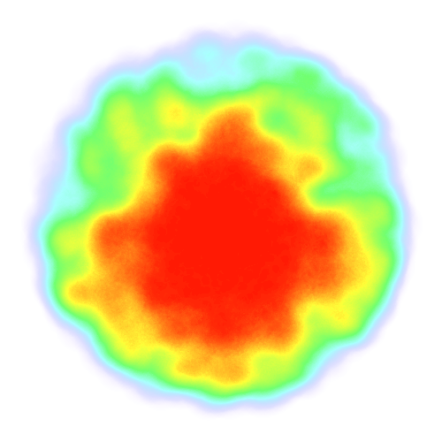

# Heatmap

Heatmaps for node.js and the browser!



## Example

### blob.js

```javascript
const Heatmap = require("heatmap");
const fs = require("fs");
const heat = new Heatmap(500, 500, { radius: 30 });

for (let i = 0; i < 5000; i += 1) {
  let rho = Math.random() * 2 * Math.PI;
  let z = Math.pow(Math.random(), 2) * 200;

  let x = 250 + Math.cos(rho) * z;
  let y = 250 + Math.sin(rho) * z;

  heat.addPoint(x, y);
}

heat.draw();

fs.writeFileSync("blob.png", heat.canvas.toBuffer());
```

# Methods

## var heat = new Heatmap(...)

There are _two_ ways of creating a new heatmap:

- With the id of the target canvas element
- With the height and width values for the canvas element to be created

Optionally, you can set the `opts.radius` and `opts.threshold` to control the
rendering a little.

## heat.addPoint(x, y, params)

Add a point to the heatmap with a `radius`.

`params` must be an object and can have:

- radius, defaults to heat.radius || 20
- weight, defaults to 0.1

## heat.scale(x, y)

Scale the canvas by the coefficients `x` and `y`.

If `y` is undefined, scale both x and y by the first parameter, `x`.

## heat.draw()

Render all the points onto the canvas element.

## heat.canvas

The HTML Canvas element.

Protip: with the [canvas module](https://github.com/LearnBoost/node-canvas) for
node you can `heat.canvas.buffer()` to get a Buffer with a PNG file all up in it.

# Install

With [npm](https://npmjs.org), just do:

    npm install heatmap-pkg

Or with [yarn](https://yarnpkg.com):

    yarn add heatmap-pkg
